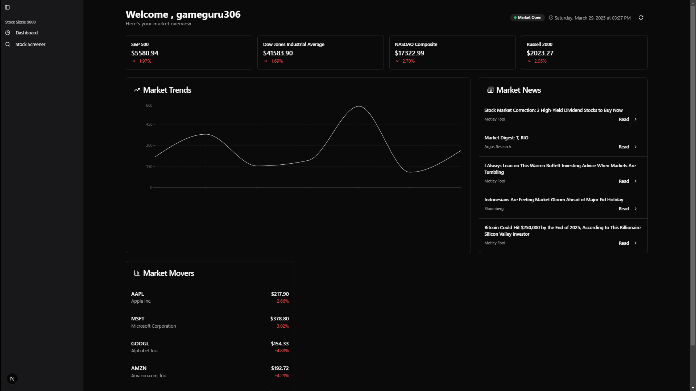
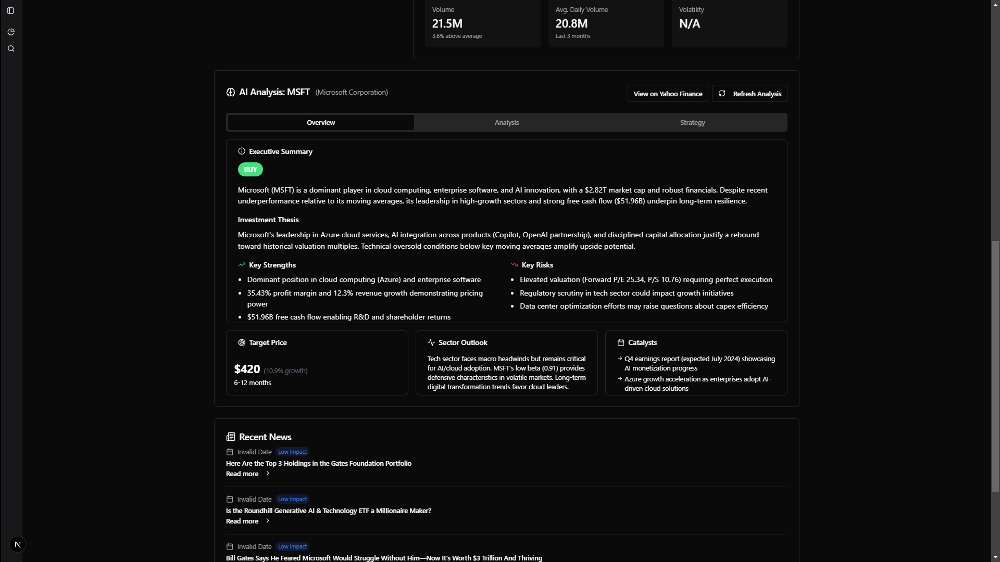
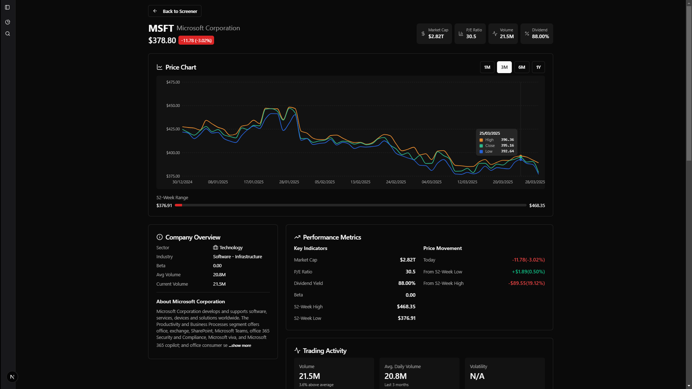
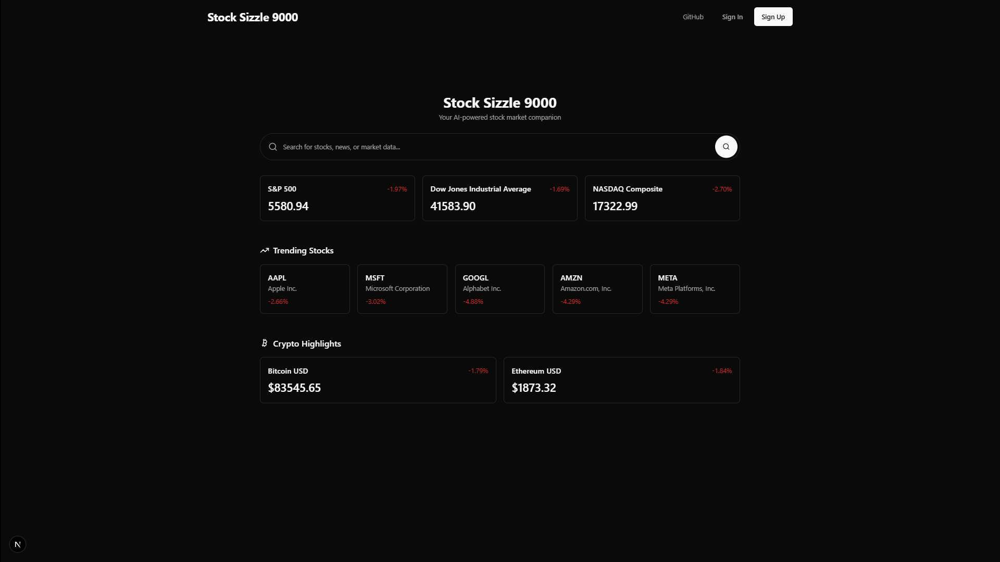
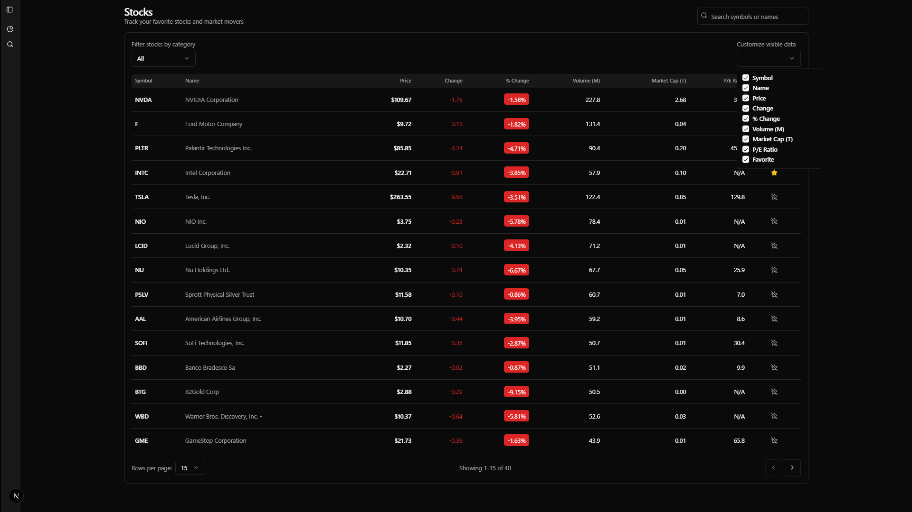
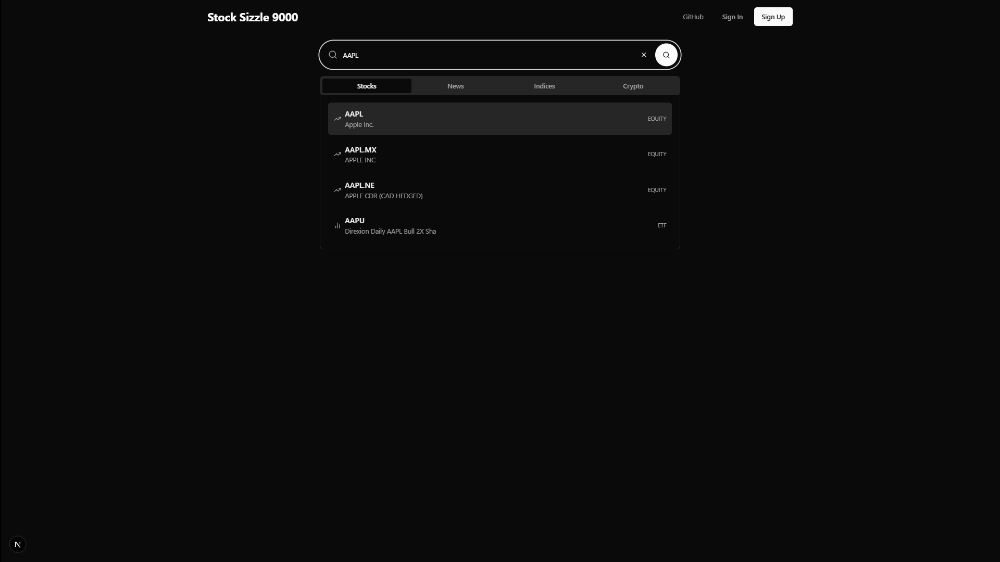

# Stock Sizzle 9000 📈

A comprehensive web application for stock market analysis, combining real-time data with AI-powered insights. Built with Next.js, Supabase, and OpenRouter.


## Features ✨
- **Real-time Stock Data**: Fetch prices, news, and historical trends via Yahoo Finance API.
- **LLM-Powered Analysis**: AI-driven insights using OpenRouter for financial news and sentiment analysis.
- **Stock Screening**: Filter stocks by metrics and save watchlists.
- **User Authentication**: Secure sign-up/login flows with Supabase.
- **Responsive UI**: Modern interface built with Shadcn UI components and Tailwind CSS.
- **Interactive Charts**: Visualize stock performance with Recharts.

## Technologies 🛠️
- **Frontend**: Next.js 15, React 19, Shadcn UI, Tailwind CSS, Recharts
- **Backend**: Supabase (PostgreSQL)
- **APIs**: Yahoo Finance API, OpenRouter API
- **Tools**: Git, VSCode, Bun (JavaScript runtime)

## Installation 🚀
1. Clone the repository:
   ```bash
   git clone https://github.com/bionicop/stock-ai.git
   cd stock-ai
   ```
2. Install dependencies:
   ```bash
   bun install
   ```
3. Set up environment variables:
   ```env
   NEXT_PUBLIC_SUPABASE_URL=your_supabase_url
   NEXT_PUBLIC_SUPABASE_ANON_KEY=your_supabase_key
   OPENROUTER_API_KEY=your_openrouter_key
   ```
4. Run the app:
   ```bash
   bun run dev
   ```

## Usage 📋
1. **Sign Up/Login**: Create an account or log in to access the dashboard.
2. **Dashboard**: View market overview, trending stocks, and recent updates.
3. **Search Stocks**: Use the search bar to find stocks by symbol or name.
4. **Stock Analysis**: Get detailed financial data, charts, and AI-powered insights.
5. **Screener**: Filter stocks based on various financial metrics and performance indicators.

## Screenshots 🖼️
| Dashboard | Stock Analysis | Stock Details |
|-----------|----------------|---------------|
|  |  |  |

| Home Page | Stock Screener | Search Results |
|-----------|----------------|----------------|
|  |  |  |

## Key Components 🧩
- **Yahoo Finance Integration**: Real-time stock data fetching and caching
- **OpenRouter AI**: LLM-powered stock analysis and investment recommendations
- **Authentication**: Secure user management with Supabase

## Future Work 🔮
- Integrate Python-based AI agents with LangChain, and PydanticAI for more advanced analysis/predictions.
- Add real-time notifications for market changes.
- Expand technical indicators for chart analysis.
- Implement portfolio tracking and performance monitoring.
- Add social features for sharing investment ideas.

## Acknowledgments 🙏
- **Prof. Pranav Sahasrabudhe** for inspiring the project.
- **Dr. Aniket Suresh Nagane** for mentorship.
- **Gadicc** ([Yahoo Finance 2 API](https://github.com/gadicc/node-yahoo-finance2)) and **OpenRouter** for critical tools.

---

**Contribute**: Feel free to submit issues or PRs!
